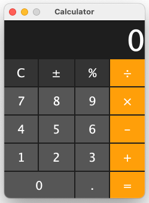

# Swing Calculator

A very simple calculator written in Java, similar to the basic one that comes with the Mac.

After more than 10 years of Java development experience, I realized that I had never written a Java Swing application. So, I decided to build a simple calculator to learn how to use Swing, even though there is no practical reason to use this technology nowadays.

Building it was also useful for studying for my college's Modular Programming exam, which has Java Swing as one of its topics.

---

  

